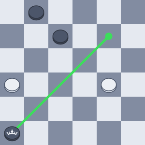

# Valid Draughts Moves

[International draughts](https://en.wikipedia.org/wiki/International_draughts)
(also called Polish draughts or international checkers) is a strategy board game
for two players, one of the variants of draughts. In this kata we will use the
outside-in classist test-driven development approach to list all valid moves in
any given board position.

# Preparation
Read Martin Fowler's two articles: 1) [Test-Driven
Development](https://martinfowler.com/bliki/TestDrivenDevelopment.html) and 2)
[Mocks Aren't Stubs](https://martinfowler.com/articles/mocksArentStubs.html).

Watch [Outside-In Classicist TDD by Sandro Mancuso - Mars
Rover](https://www.youtube.com/watch?v=24vzFAvOzo0) to see how to use classist
TDD in practice. Also pay attention to the IDE shortcuts that he uses, maybe
there is something worth picking up.

Read through this README.

Setup your environment, clone the repo and import it into your IDE.

# Game rules


1. The game is played on a board with 10×10 squares, alternatingly dark and
   light. The lower-leftmost square should be dark.

2. Each player has 20 pieces. In the starting position (see illustration) the
   pieces are placed on the first four rows closest to the players. This leaves
   two central rows empty.

3. There are two types of pieces, men and kings. In the beginning all pieces are
   men.

4. A player wins when the opponent does not have any pieces left or the opponent
   cannot make a move.

## A turn

The black and white players will alternate turns until the game ends. In the
example images below, we assume that white starts from the bottom and black
starts from the top. A single turn has the following rules:

1. Pieces (men and kings) can only move on the dark squares, i.e. the white
   squares are always empty.

2. Men can only move one space diagonally forward per turn (with the exception
   of capturing).

   

3. Kings move multiple spaces diagonally forward or backwards. A king can only
   move in one direction per turn (with the exception of capturing).
   
   

4. Capturing is made by jumping – a man captures by moving two consecutive steps
   in the same direction, jumping over a single piece (man or king) on the first
   step. Multiple opposing pieces may be captured in a single turn if this is
   done by successive jumps made by one piece.

5. When capturing, pieces can jump both diagonally forwards and backwards. It is
   possible to change direction between jumps. Here's an example turn for a man:

   

6. Kings captures just like men with the exception that a king does not have to
   be adjacent to a piece to jump over it. Additionally, he does not need to
   land adjacent to the captured piece, he can land on any free square behind
   the captured piece, given that no other piece is between that free square and
   the captured piece. Here's an example turn:

   

7. Only one piece can be captured per jump. But it is possible to capture
   multiple pieces per turn, with multiple jumps.

8. It is not possible to capture or jump over pieces of the same color. It is
   also not possible for a piece to end a turn ontop of another piece.

9. Capturing is absolutely mandatory. If there is a capture possible for the
   player, they have to do it.

10. If a player has several capture options, it’s compulsory to capture the
   maximum amount of the opponent's pieces.

11. A man ending his turn on the last row becomes king. We say it’s crowned.

12. A man is crowned (he becomes king) only if he finishes his move on the last
   row. In the situation depicted in the image below, man does not become king,
   since the the man is forced to do a jump that does not let him end his turn
   on the last row.

      

13. When a man is crowned, he cannot continue capturing as a king in the same
    turn.

14. A captured piece is not removed from the board until the turn is over. A
    captured piece cannot be jumped over a second time in the same turn.

# Text representations

There is a [standard text representation for
draught](https://en.wikipedia.org/wiki/Portable_Draughts_Notation), but we'll
use our own text representations for board positions and moves to make it more
visual.

## Board position

1. A dot indicates a light square.
2. An underscore indicates an empty dark square.
3. Lowercase w indicates a white man.
4. Lowercase b indicates a black man.
5. Capital K indicates a white king (Capital W looks too visually similar to w).
6. Capital B indicates a black king.
7. White always starts at the bottom of the board.

Here is an example board:
```
.K._._._._
_.b._._._.
._._.b._._
_._._._.b.
._._._.b._
_._._.w._.
._._._._.b
_._.w.b.w.
._._._._._
_.B.w._._.
```

## Turn

Each dark square will have a number assigned to it. The first digit is the
x-axis, the second digit is the y-axis, like this:
```
   19    39    59    79    99
08    28    48    68    88   
   17    37    57    77    97
06    26    46    66    86   
   15    35    55    75    95
04    24    44    64    84   
   13    33    53    73    93
02    22    42    62    82   
   11    31    51    71    91
00    20    40    60    80   
```

A move is the starting position and the end positing with a dash between, like
`44-35`. When a piece is captured, we denote that with an "x" instead of a dash
like this: `44x26`. Each captured piece in a series of captures is denoted with
an "x", like `71x44x99`.

# Requirements

Create a method that takes the input:

1. A board position as a string in format above
2. The color of the player whose turn it is as an enum

And returns the output:

1. A list of possible turns as strings.

For example, if the starting position is given as input (see first illustration
in this README), and it is white's turn, then the result should be:

```
[04-15, 24-15, 24-35, 44-35, 44-55, 64-55, 64-75, 84-75, 84-95]
```
Order does not matter.

# Environment Setup

I suggest that you use Java 17 since it is the only LTS Java release with
support for text blocks. Text blocks will come in handy because of how we
represent the board.

On linux, Java 17 is installed with:
```
sudo apt install openjdk-17-jdk
sudo apt install openjdk-17-source
```

Support for Java 17 in Eclipse was added in version 4.21. To see which version
you have, look at Help > About Eclipse IDE. If you have an
older version, you'll have to
[upgrade](https://unifaun.atlassian.net/wiki/spaces/GD/pages/156646247/Eclipse#Upgrading-existing-Eclipse-IDE-and-Installed-Features-to-newer-release)
or install to a newer version. If you choose to install a new version, you'll
have to install your plugins again like TestNG, Sonar, MoreUnit and MagicLabel
if you use that.

Make Java 17 available in Eclipse by doing the following:

1. Go to Window > Preferences
2. In Java > Installed JREs, click Add...
3. Select Standard VM and press Next
4. Set JRE home to `/usr/lib/jvm/java-17-openjdk-amd64`. The JRE name is
   defaulted to `java-17-openjdk-amd64` which is fine.
5. Press Finish
6. Press Apply and Close

If you want to run the tests with java 17 without changing any environment
variables, you can do it like this:

```
./gradlew test -Dorg.gradle.java.home=/usr/lib/jvm/java-17-openjdk-amd64
```

where `/usr/lib/jvm/java-17-openjdk-amd64` is the path to your java 17
installation.

## Eclipse import
Clone this repo with the command:
```
git clone git@bitbucket.org:unifaun/valid-draughts-moves.git
```
Import the project as a Gradle project in Eclipse or your preferred IDE. In
Eclipse, you can import the project via:

1. File > Import...
2. Select Existing Gradle Project
3. Select the directory in which this README exists
4. Press Finish